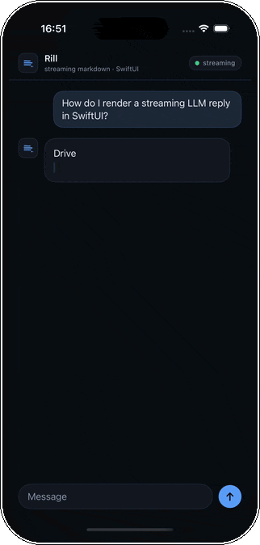
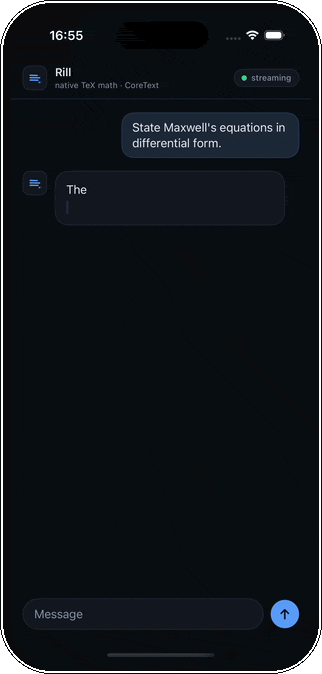
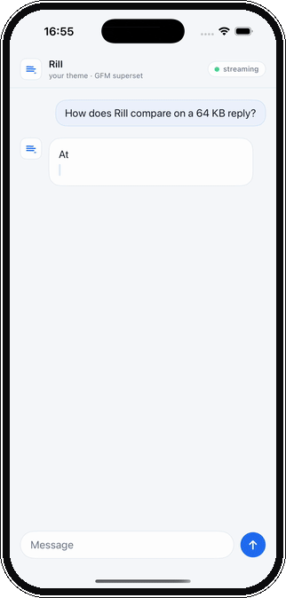

# RillChat

A self-contained example: an iOS chat client that renders streamed assistant
answers with [Rill](../../). It is the source of the captures in the
[top-level README](../../README.md).

<p>
  
  
  
</p>

## What it shows

- **Streaming.** Each assistant turn is fed to a `MarkdownSource` token-by-token
  (`ChatView.play()`), showing the word-fade reveal and the live tail redrawing
  while committed blocks stay put.
- **Theming.** `RillTheme.chat(_:)` builds an explicit theme (fonts, the full
  color set, a syntax palette, metrics) from a small `Palette`, and
  `RenderConfig` drives the append animation. Two palettes ship, dark and light.
- **Supported syntax.** Code with syntax highlighting, native TeX math, GitHub
  alerts, pipe tables, citations, and footnotes, rendered on-device.

## Run it

```bash
cd Examples/RillChat
xcodegen generate            # writes RillChat.xcodeproj from project.yml
open RillChat.xcodeproj       # ⌘R on an iPhone simulator
```

Pick which conversation plays with the `RILL_SCENE` environment variable
(`coding` · `math` · `docs`) in the scheme's run arguments.

## Layout

- `Sources/RillChatKit/` — the reusable pieces: `Palette`, `RillTheme.chat`, the
  `RillMark` avatar drawn in SwiftUI, `ChatView`, and the sample `Conversation`s.
- `App/RillChatApp.swift` — the `@main` entry point.

Only `RillUI` is linked. To bring your own rendering instead, depend on
`RillCore` alone and drive its incremental parser directly — see
[Just the parser](../../README.md#just-the-parser-rillcore) in the main README.
