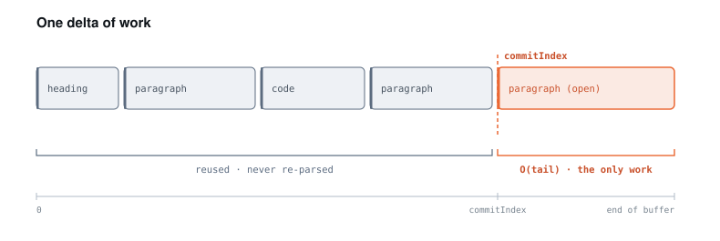
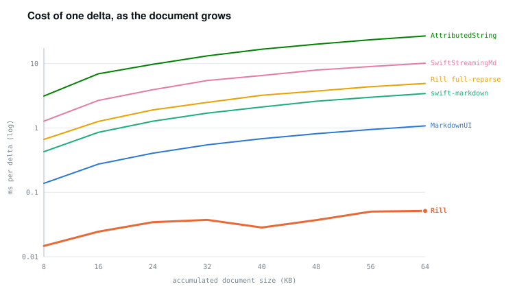
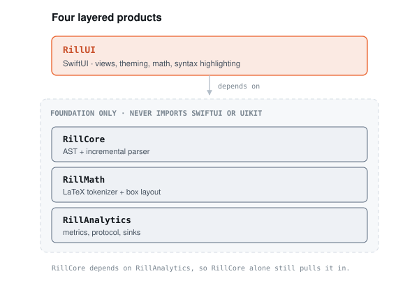

<p align="center">
  
</p>

<h1 align="center">Rill</h1>

<p align="center">
  Incremental Markdown parsing and SwiftUI rendering for streamed text.<br>
  Each delta re-parses only the dirty tail — <strong>O(tail)</strong>, not <strong>O(document)</strong>.
</p>

<p align="center">
  <a href="https://swift.org"></a>
  <a href="#installation"></a>
  <a href="#installation"></a>
  <a href="LICENSE"></a>
  <a href="https://github.com/joydle/rill/actions/workflows/ci.yml"></a>
</p>

Rill renders Markdown that arrives incrementally, such as an LLM response streamed
token by token. It freezes a committed prefix of closed blocks and re-lexes only the
dirty tail on each delta, so per-delta parse cost does not grow with the length of
the document already rendered.

The package has no external dependencies, renders LaTeX math natively, supports GFM
footnotes and GitHub alerts, and emits parse and render telemetry.

<table>
  <tr>
    <td width="33.3%"></td>
    <td width="33.3%"></td>
    <td width="33.3%"></td>
  </tr>
  <tr>
    <td align="center"><sub>Streaming an answer, token by token</sub></td>
    <td align="center"><sub>Native TeX math, no font atlas</sub></td>
    <td align="center"><sub>Custom theme: tables, alerts, footnotes</sub></td>
  </tr>
</table>

<sub>iOS Simulator captures. Source: <a href="Examples/RillChat"><code>Examples/RillChat</code></a>.</sub>

---

## Contents

- [How it works](#how-it-works)
- [Benchmarks](#benchmarks)
- [Features](#features)
- [Installation](#installation)
- [Quick start](#quick-start)
- [Streaming](#streaming)
- [Theming](#theming)
- [Analytics](#analytics)
- [Examples](#examples)
- [Just the parser (RillCore)](#just-the-parser-rillcore)
- [Supported feature matrix](#supported-feature-matrix)
- [Architecture](#architecture)
- [Contributing](#contributing)
- [License](#license)

---

## How it works

A Markdown renderer that re-parses the entire accumulated text on every streamed
snapshot does O(document) work per delta, so the per-delta cost rises as the response
grows, and already-finished content re-renders on every token.

<picture>
  <source media="(prefers-color-scheme: dark)" srcset="docs/images/diagrams/commit-boundary-dark.svg">
  
</picture>

Rill takes a different approach:

- **Incremental parse.** A committed prefix of definitively-closed blocks is frozen and
  memoized by a stable, content-derived `NodeID`; only the open tail is re-lexed per
  delta. Per-delta cost is proportional to the dirty tail rather than the whole buffer.
- **Stable-identity rendering.** Committed blocks are `Equatable`-gated by `NodeID`, so
  SwiftUI elides `body` evaluation for them and only the live tail re-evaluates.
- **Streaming equivalence.** For any input and any chunking, the final `Document` is
  identical to a one-shot parse. This is property-tested over a fixed corpus plus
  hundreds of randomly-assembled documents, each fed byte-by-byte, in random chunks,
  and as growing snapshots, with UTF-8-boundary cuts.

The commit boundary is deliberately conservative: when a construct could still be
changed by a future line (a trailing paragraph, an open fence, a list that a blank
line might extend), it stays in the live tail rather than being committed. See
[`docs/ARCHITECTURE.md`](docs/ARCHITECTURE.md) for the mechanism in detail.

---

## Benchmarks

The `Benchmarks/` package measures Rill's incremental parser against several
full-reparse strategies. Each streams the same synthetic document in 256-byte chunks
and re-processes the accumulated buffer on each chunk; the reported number is the
cumulative wall-clock time to process the whole stream.

<picture>
  <source media="(prefers-color-scheme: dark)" srcset="docs/images/diagrams/bench-perdelta-dark.svg">
  
</picture>

**64 KB streamed document** (release build, Swift 6.3, arm64 macOS):

| Approach | Cumulative parse time | Ratio vs Rill |
| --- | ---: | ---: |
| Rill — incremental | 9.0 ms | — |
| [MarkdownUI](https://github.com/gonzalezreal/swift-markdown-ui) 2.4.1 (cmark-gfm) | 144 ms | 16× |
| [swift-markdown](https://github.com/swiftlang/swift-markdown) 0.7.3 (cmark-gfm) | 443 ms | 49× |
| [Microsoft `SwiftStreamingMarkdown`](https://github.com/microsoft/SwiftStreamingMarkdown) (rev `947e958`) | 1,357 ms | 151× |
| Apple `AttributedString(markdown:)` † | 3,472 ms | 385× |

† `AttributedString(markdown:)` produces a flat run list rather than a navigable block
AST — lists collapse and tables lose structure — so its number reflects a simpler parse
doing less work, not a faster equivalent one. It is included as the built-in baseline,
not as a like-for-like comparison.

Over a 60× increase in document size (1 KB → 64 KB), Rill's cumulative time grew 24×,
which is approximately linear in total bytes streamed. The full-reparse strategies grew
between roughly 1,000× and 1,650× over the same range.

**Small documents.** Rill is not the fastest option for a short one-shot parse. At 1 KB,
both cmark-gfm-based parsers are faster in absolute terms (MarkdownUI 0.10 ms,
swift-markdown 0.30 ms, Rill 0.38 ms); Rill's Swift engine carries more per-call
overhead. Its advantage comes from per-delta cost staying proportional to the tail, so
it only appears as the streamed document grows.

Absolute times depend on the machine and vary between runs; the ratios and growth shape
are the reproducible result, and the ratios above moved by a few percent across repeated
runs on the same machine. Regenerate the whole report with `swift run -c release
RillBench` from `Benchmarks/`. Full matrix (1/4/16/64 KB, per-delta curves, method,
dependency pins): [`Benchmarks/RESULTS.md`](Benchmarks/RESULTS.md). A feature and
dependency comparison with `SwiftStreamingMarkdown` is in
[`docs/COMPARISON.md`](docs/COMPARISON.md).

---

## Features

- **Incremental parsing.** A committed byte prefix of definitively-closed blocks is
  frozen and memoized by stable `NodeID`; only the open tail is re-parsed on each delta.
- **Streaming equivalence.** For any input and any chunking, the final `Document` is
  identical to a one-shot parse, property-tested as described above.
- **Stable-identity rendering.** Committed blocks are `Equatable`-gated by `NodeID`, so
  only the live tail re-evaluates. An optional SwiftUI-native word-fade append animation
  is available for the streaming tail.
- **Native LaTeX math.** A TeX-style box and glue layout engine in pure Swift and
  CoreText. No bundled font atlases, no image rasterization. Unknown commands degrade to
  literal text.
- **Analytics.** Parse and render telemetry plus interaction events through a `Sendable`
  sink protocol, with `os.signpost` intervals for Instruments, a multiplexing sink, and a
  no-op default.
- **CommonMark subset plus GFM extensions.** Headings, lists (nested, tight/loose, task
  lists), blockquotes, fenced and indented code, pipe tables with alignment,
  strikethrough, autolinks, citations, footnotes, GitHub alerts
  (`> [!NOTE]`/`TIP`/`IMPORTANT`/`WARNING`/`CAUTION`), and inline and block math.
- **Themeable and pluggable.** A fully-populated default theme, a `CodeHighlighter`
  protocol with built-in grammars, an `ImageLoading` protocol, citation resolution, and
  link handling — all injectable, none required.
- **Layered, UI-free core.** `RillCore`, `RillMath`, and `RillAnalytics` never import
  SwiftUI or UIKit (compiler- and test-enforced). Only `RillUI` touches the view layer.
- **Bounded recursion.** The block lexer, inline parser, and math parser cap recursion
  depth, so deeply-nested input (chained blockquotes, `[[[…]]]`, stacked footnotes)
  degrades to literal text instead of overflowing the stack.

---

## Installation

Add Rill to your `Package.swift` dependencies:

```swift
dependencies: [
    .package(url: "https://github.com/joydle/rill.git", from: "1.0.0"),
]
```

Rill is at `1.0.0` and the public API follows [Semantic Versioning](https://semver.org).
Requires Xcode 16+ (Swift 6.0), iOS 18+, macOS 15+.

Then depend on `RillUI` from your target. `RillUI` re-exports `RillAnalytics` and
`RillMath`, so `import RillUI` is enough for the views and the analytics types. If you
work with the parsed `Document` AST directly, also depend on and `import RillCore`:

```swift
.target(
    name: "YourApp",
    dependencies: [
        .product(name: "RillUI", package: "rill"),
    ]
)
```

Or consume it as a local package:

```swift
.package(path: "../rill")
```

To use only the parser without the view layer, depend on `RillCore` directly. The four
products are:

- `RillCore` — Foundation-only AST and incremental parser
- `RillMath` — Foundation-only LaTeX tokenizer and box layout
- `RillAnalytics` — Foundation-only metrics, protocol, and sinks
- `RillUI` — the SwiftUI renderer (depends on the other three)

---

## Quick start

Render a finished Markdown string with the static `MarkdownView`:

```swift
import SwiftUI
import RillUI

struct ContentView: View {
    let answer = """
    # Rill

    Render **Markdown** that streams, with native math like $E = mc^2$ and code:

    ```swift
    print("Hello, Rill!")
    ```
    """

    var body: some View {
        ScrollView {
            MarkdownView(answer)
                .padding()
        }
    }
}
```

`MarkdownView` parses once and renders through the same engine as the streaming
path, so static and fully-streamed content produce an identical `Document`.

---

## Streaming

For incremental rendering, drive a `MarkdownSource` and feed it deltas with
`append(_:)`. The view re-evaluates only the live tail as text arrives.

```swift
import SwiftUI
import RillUI

struct StreamingAnswerView: View {
    @State private var source = MarkdownSource()

    var body: some View {
        ScrollView {
            StreamingMarkdownView(source)
                .padding()
        }
        .task {
            // Simulate an LLM streaming a response token-by-token.
            let tokens = ["# Result\n\n", "The answer ", "is **42**", ".\n\n", "Done."]
            for token in tokens {
                source.append(token)              // O(tail) re-parse per delta
                try? await Task.sleep(for: .milliseconds(40))
            }
        }
    }
}
```

If you hold the full accumulated string instead of per-token deltas, call
`source.setSnapshot(fullText)` — the engine still only re-parses from the first
changed byte.

---

## Theming

`RillTheme` is a `Sendable` value type with fonts, colors, metrics, and code-block
presentation. The `default` is fully populated, so no configuration is required; build
your own by copying `.default` and overriding fields:

```swift
import SwiftUI
import RillUI

extension RillTheme {
    static let brand: RillTheme = {
        var theme = RillTheme.default
        theme.colors.link = .pink
        theme.colors.citation = .purple
        theme.metrics.paragraphSpacing = 16
        theme.codeBlock = .inlineScrollable(maxPreviewLines: 8)
        return theme
    }()
}

struct ThemedView: View {
    var body: some View {
        MarkdownView("[Rill](https://example.com) is **fast**.", theme: .brand)
    }
}
```

Behavioral hooks live in `RenderConfig` — link handling, citation resolution, and
async image loading via the `ImageLoading` protocol:

```swift
let config = RenderConfig(
    citationResolver: { marker in CitationTarget(title: "Source \(marker)", url: nil) },
    linkHandler: { url in print("tapped", url) }
)

MarkdownView(answer, theme: .brand, config: config)
```

---

## Analytics

Conform to `MarkdownAnalytics` (a `Sendable` protocol) to receive parse,
render, and interaction telemetry. Built-in sinks include `NoopAnalytics`
(the default), `OSLogAnalytics` (emits `os.signpost` intervals visible in
Instruments), and `MultiplexAnalytics` to fan out to several sinks at once.
`import RillUI` re-exports these types; the explicit `RillAnalytics` import below
is optional, shown for clarity.

```swift
import RillUI

/// A sink that counts how many blocks re-render versus skip during streaming.
final class RenderCounter: MarkdownAnalytics, @unchecked Sendable {
    private(set) var rendered = 0
    private(set) var skipped = 0

    func didParse(_ m: ParseMetrics) {
        print("parse: dirtyTail=\(m.dirtyTailBytes)/\(m.totalBytes) reused=\(m.blocksReused)")
    }
    func didRender(_ m: RenderMetrics) {
        rendered += m.blocksRendered
        skipped += m.blocksSkipped
    }
    func didInteract(_ e: MarkdownInteraction) {
        print("interaction:", e)
    }
}

let analytics = MultiplexAnalytics([OSLogAnalytics(), RenderCounter()])
let source = MarkdownSource(analytics: analytics)
```

These metrics let you verify the parsing behavior in your own app:
`ParseMetrics.dirtyTailBytes` stays small relative to `totalBytes` and `blocksReused`
grows during a streaming session, while `RenderMetrics.blocksSkipped` reports how many
committed blocks were not redrawn. `RenderMetrics` counts are structural — the renderer
does not time itself.

---

## Examples

Three runnable sample apps live in the repo:

- **[`Examples/RillChat`](Examples/RillChat)** — an iOS chat client, the source of the
  captures above. It streams each answer token-by-token through a `MarkdownSource` and
  exercises the theming surface (dark and light `RillTheme`s built from a small palette),
  native math, syntax-highlighted code, GitHub alerts, tables, citations, and footnotes.
- **[`Examples/RillDemo`](Examples/RillDemo)** — a macOS SwiftUI app with a
  chunked-streaming simulator, theme switcher, and a live analytics HUD (parse time,
  dirty-tail bytes, blocks reused vs. re-rendered).
- **[`Examples/RillDemoiOS`](Examples/RillDemoiOS)** — an iOS Simulator wrapper around the
  shared demo kit.

---

## Just the parser (RillCore)

To render the output yourself, depend on **`RillCore`** alone — Foundation-only, no UI —
and drive the incremental parser directly. You get the same streaming engine and a
`Sendable` `Document` AST:

```swift
import RillCore

let parser = IncrementalParser()
parser.consume(delta: "# Hello\n\nWorld", at: 0)   // or consume(snapshot:)

for block in parser.document.blocks {              // walk the AST yourself
    switch block {
    case .heading(let heading):     renderHeading(heading)
    case .paragraph(let paragraph): renderParagraph(paragraph)
    case .codeBlock(let code):      renderCode(code)
    default:                        break
    }
}
```

`Document`, `Block`, and `Inline` are value types keyed by a stable, content-derived
`NodeID`, so you can diff and skip unchanged blocks in your own view layer the same way
`RillUI` does.

---

## Supported feature matrix

| Category | Feature | Status |
| --- | --- | --- |
| **Headings** | ATX `#`…`######` (levels 1–6) | ✅ |
| **Paragraphs** | Blank-line separation, soft/hard breaks | ✅ |
| **Emphasis** | `*italic*`, `**bold**`, `***both***`, nesting | ✅ |
| **Strikethrough** | `~~del~~` (GFM) | ✅ |
| **Code** | Inline `` `code` `` | ✅ |
| **Code blocks** | Fenced (```` ``` ````/`~~~`) + indented, language tag, `isClosed` | ✅ |
| **Lists** | Ordered/unordered, nested, tight/loose | ✅ |
| **Task lists** | `- [x]` / `- [ ]` (GFM) | ✅ |
| **Blockquotes** | Nested | ✅ |
| **GitHub alerts** | `> [!NOTE]` / `TIP` / `IMPORTANT` / `WARNING` / `CAUTION` | ✅ |
| **Citations** | Inline `[1]` / `[^id]` markers → themeable pill (resolver-backed) | ✅ |
| **Footnotes** | Definition blocks `[^id]: …` collected into a footnotes section (GFM) | ✅ |
| **Tables** | GFM pipe tables with `:---:` column alignment | ✅ |
| **Thematic breaks** | `---` / `***` / `___` | ✅ |
| **Links** | `[text](url "title")` + autolinks `<https://…>` + bare URLs | ✅ |
| **Images** | ``, async via `ImageLoading`, alt-text fallback | ✅ |
| **Inline math** | `$x$` / `\(x\)` | ✅ |
| **Block math** | `$$…$$` / `\[…\]`, native TeX box layout | ✅ |
| **Syntax highlighting** | Swift, JS/TS, Python, JSON, Bash, HTML, Rust + generic | ✅ |
| **Raw HTML** | Captured and rendered as escaped text | ⚠️ escaped |
| **Editing / round-trip** | — | ❌ render-only |

✅ supported · ⚠️ partial / graceful degradation · ❌ out of scope for 1.0

> An inline `[^id]` renders as a citation pill linked to its `[^id]: …` definition; the
> two rows above are the two halves of one footnote mechanism, not separate syntaxes.

---

## Architecture

One SPM package, four layered products. The pure logic never imports UI
(compiler- and test-enforced):

<picture>
  <source media="(prefers-color-scheme: dark)" srcset="docs/images/diagrams/layers-dark.svg">
  
</picture>

`RillCore` depends on `RillAnalytics` (also Foundation-only) to emit `ParseMetrics`, so
depending on `RillCore` alone still pulls in `RillAnalytics`. No module except `RillUI`
imports SwiftUI or UIKit.

See [`docs/ARCHITECTURE.md`](docs/ARCHITECTURE.md) for how the engine works (the AST, the
dirty-tail match, and stable-identity rendering), and
[`docs/COMPARISON.md`](docs/COMPARISON.md) for the feature and dependency comparison with
`SwiftStreamingMarkdown`.

---

## Contributing

Contributions are welcome — see [`CONTRIBUTING.md`](CONTRIBUTING.md). Run `swift build`
and `swift test`; both must pass cleanly.

## License

Rill is available under the MIT license. See [`LICENSE`](LICENSE).
