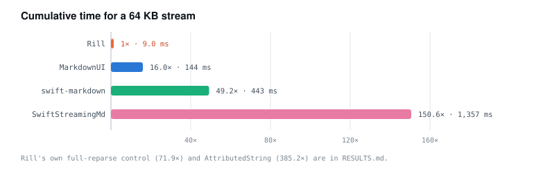

# Comparison with SwiftStreamingMarkdown

A factual comparison between Rill and
[`microsoft/SwiftStreamingMarkdown`](https://github.com/microsoft/SwiftStreamingMarkdown),
the other Swift package aimed at rendering incrementally-streamed Markdown.

The two packages make different trade-offs. `SwiftStreamingMarkdown` builds on
established components (swift-markdown, iosMath, HighlightSwift) and ships a mature
UIKit/AppKit render layer. Rill implements its own parser, math layout, and syntax
highlighting in order to have no dependencies and an incremental parse path.

---

## 1. Summary

| Dimension | SwiftStreamingMarkdown | Rill |
|---|---|---|
| Streaming parse cost per delta | O(document) — re-parses each snapshot | O(tail) — re-lexes the dirty suffix |
| 64 KB streamed document, cumulative parse | 1,357 ms | 9.0 ms |
| Dependencies | swift-markdown, cmark-gfm, iosMath, HighlightSwift | none |
| Analytics | 5 interaction/render callbacks | interaction callbacks plus parse/render metrics |
| Math | iosMath (UIKit/AppKit view), regex preprocessor | SwiftUI/CoreText box layout |
| Footnotes, GitHub alerts, task lists | not supported | supported |
| Node identity | structural index path (`Markup+ID.swift:16`) | content-derived `NodeID` (FNV-1a digest, position-disambiguated) |
| Platforms | iOS, macOS (AppKit `NSTextView` renderer) | iOS 18+, macOS 15+ (SwiftUI) |
| Render layer maturity | `CADisplayLink` per-word fade, view reuse, snapshot-test history | word-fade append animation, not measured on-device under load |

---

## 2. Parse performance

Measured with `swift run -c release` from `Benchmarks/`. Synthetic well-formed Markdown
streamed in 256-byte chunks; the figure is cumulative wall-clock time to process the whole
growing stream. Full method, per-delta curves, and dependency pins are in
[`../Benchmarks/RESULTS.md`](../Benchmarks/RESULTS.md).

<picture>
  <source media="(prefers-color-scheme: dark)" srcset="images/diagrams/bench-cumulative-dark.svg">
  
</picture>

| Streamed document | SwiftStreamingMarkdown | Rill incremental | Ratio |
|---|---:|---:|---:|
| 1 KB | 0.85 ms | 0.38 ms | 2.2× |
| 4 KB | 6.41 ms | 0.68 ms | 9.4× |
| 16 KB | 86.9 ms | 1.70 ms | 51.1× |
| 64 KB | 1,357 ms | 9.01 ms | 150.6× |

The ratio widens with document size, which is the expected signature of an O(tail)
algorithm measured against an O(document) one. Absolute times depend on the machine and
vary between runs; regenerate with `swift run -c release RillBench` from `Benchmarks/`.

### Why the per-delta costs differ

`SwiftStreamingMarkdown`'s streaming contract is that each emission is a complete
snapshot — a growing prefix, not a delta. Each emission re-parses the accumulated string
via `Document(parsing: targetString)` (`MarkdownParserImpl.swift:28`) after a whole-string
LaTeX preprocess, and rebuilds the renderable array; there is no parse cache, AST diff, or
prefix reuse. Their `StreamedMarkdownView` reaches this path per emission with
`speculativeRewrite: false` (`StreamedMarkdownView.swift:88` → `MarkdownParser.swift:25`).
The whole-string preprocess is why their measured time exceeds raw swift-markdown
(443 ms at 64 KB): more work is done per snapshot.

Rill freezes a committed prefix of closed blocks, memoized by `NodeID`, and re-lexes only
the dirty tail.

The benchmark drives their public parser (`MarkdownParserImpl().parse(text:)`) directly,
pinned to revision `947e958`.

### Scope of the measurement

The benchmark measures parse and convert CPU cost only. It does not measure on-screen
smoothness. `SwiftStreamingMarkdown`'s render layer — `ParagraphView`, a `UITextView` /
`NSTextView` subclass — diffs old against new attributed text and animates only the
appended characters via `CADisplayLink`, so perceived streaming smoothness is largely
decoupled from parse cost in their implementation. Rill uses a SwiftUI-native word-fade
append animation, which has not been measured on-device under load.

---

## 3. Feature matrix

Legend: ✅ full · 🟡 partial · ❌ none. The `SwiftStreamingMarkdown` column reflects
revision `947e958`.

| Feature | SwiftStreamingMarkdown | Rill | Notes |
|---|:---:|:---:|---|
| Headings, paragraphs, emphasis/strong | ✅ | ✅ | |
| Strikethrough | ✅ | ✅ | GFM |
| Inline code / fenced code | ✅ | ✅ | |
| Syntax highlighting | ✅ (HighlightSwift, JS runtime) | ✅ (built-in tokenizers) | Rill: Swift, JS/TS, Python, JSON, Bash, HTML, Rust, generic |
| Blockquotes (nested) | ✅ | ✅ | |
| Lists (ordered/unordered, nested) | ✅ | ✅ | |
| Task lists | ❌ | ✅ | |
| Tables (GFM, alignment) | ✅ | ✅ | both with a copy action |
| Links / autolinks | ✅ | ✅ | |
| Images | ❌ | ✅ | Rill: pluggable `ImageLoading`. Image nodes are dropped in their renderer, including alt text (`Paragraph+.swift:36`) |
| Inline citations | ✅ | ✅ | tappable pills |
| Footnotes | ❌ | ✅ | GFM `[^id]` plus definitions section |
| GitHub alerts (`> [!NOTE]`) | ❌ | ✅ | NOTE/TIP/IMPORTANT/WARNING/CAUTION |
| Inline `$…$` math | ❌ | ✅ | their regex preprocessor has no single-`$` inline form |
| Display math `$$…$$` / `\[…\]` | ✅ (iosMath) | ✅ (native) | see §5 |
| Raw HTML | ❌ | 🟡 | Rill captures and renders it as escaped text |
| Mermaid | ❌ | ❌ | neither |
| macOS | ✅ (AppKit `NSTextView`) | ✅ (SwiftUI) | |

---

## 4. Analytics

`MarkdownListener` exposes five interaction and render callbacks and no performance
metrics (`MarkdownListener.swift:8-14`); render events pass through a 1-slot buffer
(`bufferingNewest(1)`, `MarkdownListener.swift:33`).

Rill's `MarkdownAnalytics` protocol adds parse and render measurement:

- `didParse(ParseMetrics)` — duration, dirty-tail bytes, total bytes, blocks committed,
  blocks reused.
- `didRender(RenderMetrics)` — blocks rendered and blocks skipped. These are structural
  counts; the renderer does not time itself.
- `didInteract(MarkdownInteraction)` — link, code, citation, table, and image interactions.
- Sinks: `NoopAnalytics`, `OSLogAnalytics` (signpost intervals), `MultiplexAnalytics`.

This makes Rill's incremental-parse and skipped-render behavior observable in a running
app rather than only in the benchmark.

---

## 5. Math

`SwiftStreamingMarkdown` renders display math with **iosMath** (`MTMathUILabel`, a
UIKit/AppKit view), fed by a regex preprocessor that rewrites `$$`, `\[`, and `\(`. The
preprocessor drops some constructs, including `\boxed`, `\dfrac`, and bracket sizing, and
there is no single-`$` inline math form.

Rill renders math with a TeX-style box and glue layout engine drawn via SwiftUI Canvas and
CoreText — no bundled font atlas, no images — covering `\frac`/`\dfrac`, `\sqrt[n]`,
scripts with limits, big operators, delimiters, matrices and `cases`, accents, Greek, 337
mapped commands, and inline `$…$`.

iosMath is a mature, full TeX layout engine. For deeply-nested constructs, advanced
spacing, and the long tail of TeX, its fidelity exceeds Rill's engine. Rill's trade-offs
are footprint (no bundled engine), coverage of the input forms LLMs commonly emit
(`$…$`, `\dfrac`, `\boxed` degrading gracefully), and rendering in SwiftUI on both
platforms.

---

## 6. Dependencies

| | SwiftStreamingMarkdown | Rill |
|---|---|---|
| Direct dependencies | swift-markdown → cmark-gfm, iosMath, HighlightSwift, plus a swift-syntax macro (via `equatable`) | none |
| Main size contributors | iosMath font atlases, HighlightSwift JS runtime | pure Swift, no bundled resources |
| `unsafeFlags` | — | none, so downstream SwiftPM resolution is unaffected |

---

## 7. Node identity

`SwiftStreamingMarkdown` derives `Markup.id` from structural indices
(`Markup+ID.swift:16`). Rill derives `NodeID` from a seedless FNV-1a content digest and
disambiguates identical sibling nodes by position, so equal content yields equal identity
across processes and machines. That property is what lets Rill memoize parsed blocks and
skip re-rendering committed ones; see [`ARCHITECTURE.md`](ARCHITECTURE.md).

The two schemes serve different purposes: a structural path identifies a position in the
tree, while a content digest identifies the content itself.
